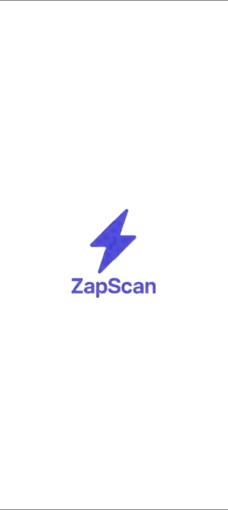
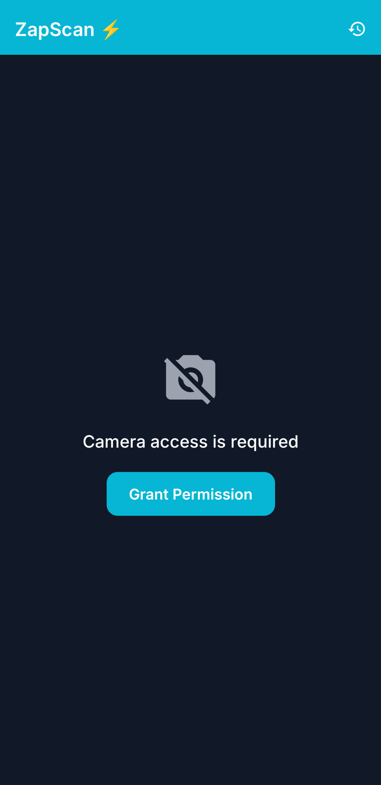
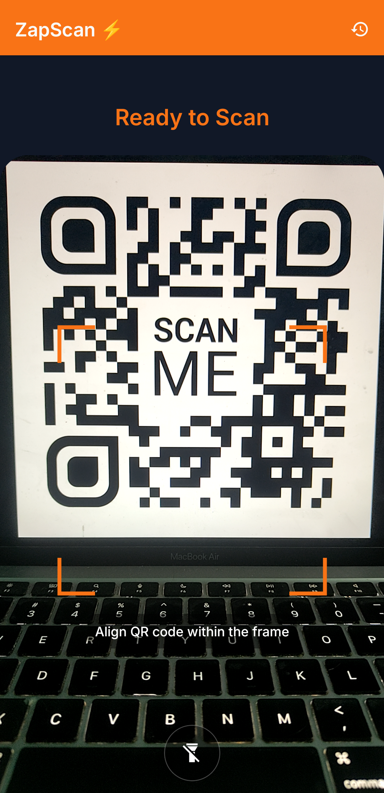
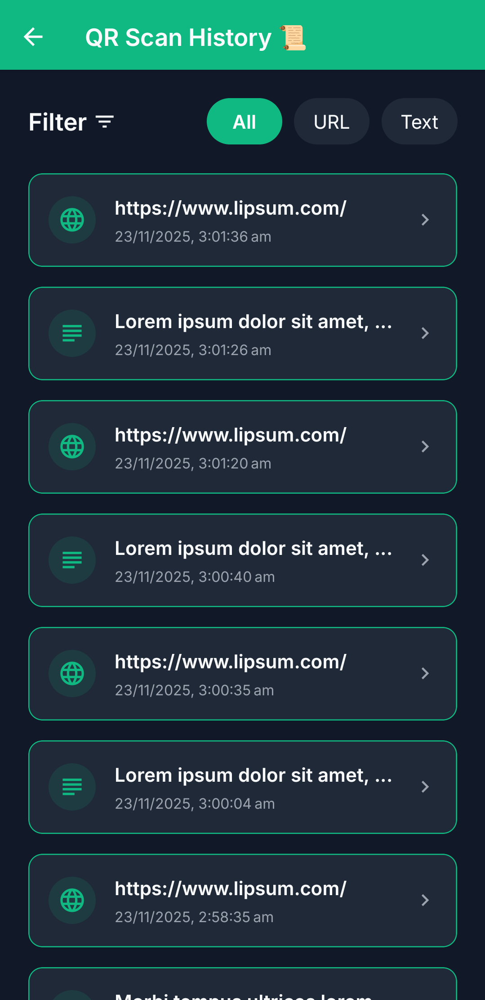
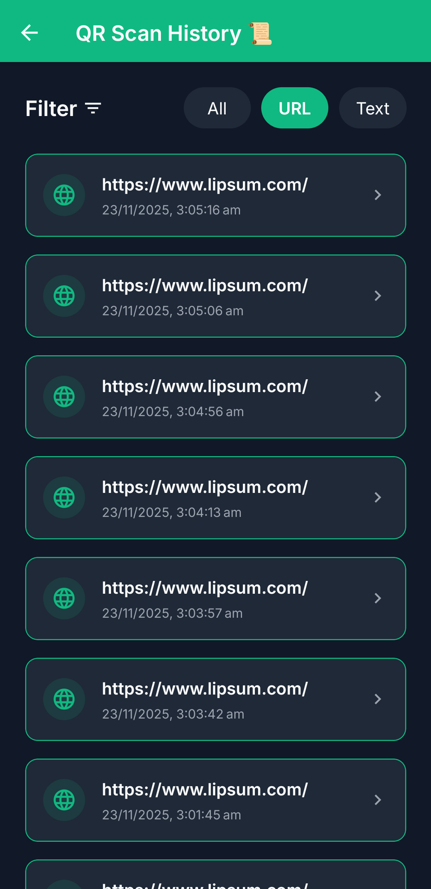
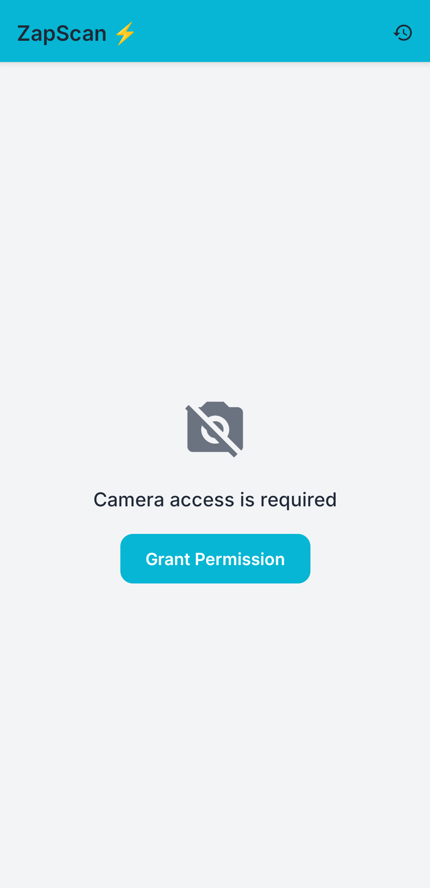
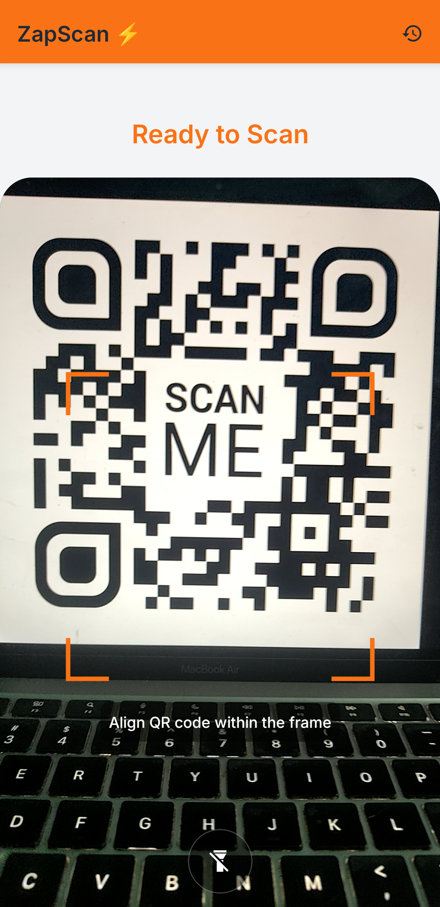
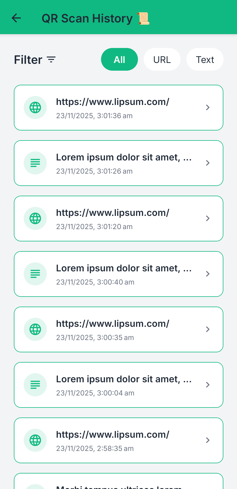
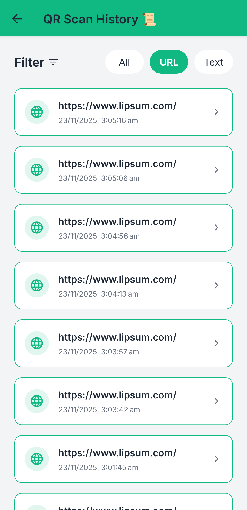
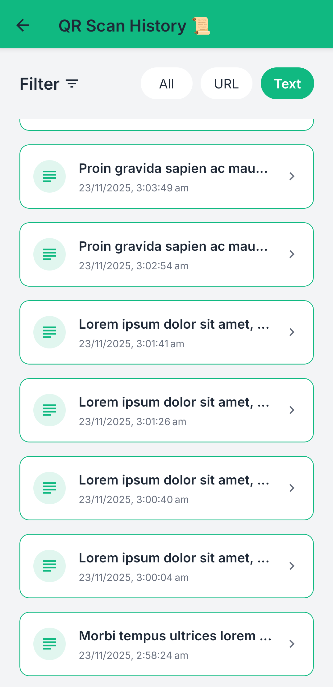

# ⚡️ ZapScan

A fast, clean, and minimal QR code scanner built with **Expo**.
Scan QR instantly, view results clearly, and keep a tidy scan history; all in one lightweight app.

## 🚀 Features

- **Instant QR scanning** with haptic feedback
- **Auto-detect URL or text**
- **Torch mode** for low-light environments
- **In-app WebView** for URLs
- **Share scanned content**
- **History with filters (All / URL / Text)**
- **Swipe to delete** items
- **Dark & Light themes** system support

## 📦 Download the APK

⬇️ [**Download ZapScan APK**](https://github.com/silver-47/ZapScan/releases/download/v1.0.0/ZapScan.apk) _v1.0.0_

## 🎥 Demo Video

<a href="./content/DemoVideo.mp4">
  
</a>

## 🖼️ Screenshots

### 🌙 Dark Mode

|                                                   |                                               |                                               |
| ------------------------------------------------- | --------------------------------------------- | --------------------------------------------- |
|  |       |     |
|      |  |  |

### 🌞 Light Mode

|                                                    |                                                |                                                |
| -------------------------------------------------- | ---------------------------------------------- | ---------------------------------------------- |
|  |       |     |
|      |  |  |

## 🛠️ How to Run Locally

### 1️⃣ Install dependencies

```bash
npm install
```

### 2️⃣ Install & Run the app on device (Development)

```bash
npx expo run:android
```

## 📦 Building the APK

### 1️⃣ Prebuild

```bash
npx expo prebuild -p android --clean
```

### 2️⃣ Build APK (Release)

```bash
cd android && (./gradlew clean && ./gradlew assembleRelease); cd ..
```

### (OR) 2️⃣ Install & Run the app on device (Release)

```bash
npx expo run:android --variant release
```
